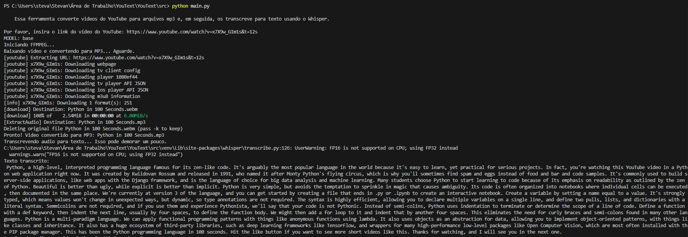

# YouText: Conversor de Vídeos do YouTube para Texto

O **YouText** é uma ferramenta que permite baixar vídeos do YouTube, extrair o áudio e transcrevê-lo para texto usando o **Whisper** da [OpenAI](https://github.com/OPENAI). É uma solução simples e eficiente para quem precisa converter conteúdo de vídeo em texto de forma rápida.

---

## 🚀 Recursos

- **Download de vídeos do YouTube**: Baixa vídeos diretamente do YouTube.
- **Extração de áudio**: Converte o vídeo baixado em um arquivo de áudio MP3.
- **Transcrição de áudio para texto**: Usa o modelo Whisper para transcrever o áudio em texto.
- **Remoção de arquivos temporários**: Remove o arquivo de áudio após a transcrição para economizar espaço.

---

## 🛠️ Tecnologias Utilizadas

- **[yt-dlp](https://github.com/yt-dlp/yt-dlp)**: Para baixar vídeos do YouTube e extrair o áudio.
- **[Whisper](https://github.com/openai/whisper)**: Modelo de transcrição de áudio da OpenAI.
- **[static_ffmpeg](https://github.com/kkroening/ffmpeg-python)**: Para garantir que o FFmpeg esteja disponível para processamento de áudio.
- **[PyTorch](https://pytorch.org/)**: Framework de machine learning utilizado pelo Whisper.

---

## 📦 Como Usar

### Pré-requisitos

1. **Python 3.8 ou superior** instalado.
2. **FFmpeg** instalado (ou use o `static_ffmpeg` incluso no projeto).
3. Dependências instaladas (veja abaixo).

### Instalação

1. Clone este repositório:

   ```bash
   git clone https://github.com/wstvns/YouText.git
   cd src
2. Crie um ambiente virtual e ative-o:
   ```bash
   python -m venv venv
   source venv/bin/activate  # No Windows, use: venv\Scripts\activate
   ```
3. Instale as dependências:

   ```bash 
    pip install -r requirements.txt
### Executando o programa

1. Execute o script:

   ```bash 
    python main.py
2. Insira o link do video do youtube.
3. Escolha o modelo Whisper (base, small, medium, large).
4. Aguarde o download, extração do áudio e transcrição.
5. O texto transcrito será exibido no terminal. E o arquivo de áudio será removido.

---

## Screenshot
Video em português:

&nbsp;
Video em inglês:


---

## 💡 Ideias Futuras
- **Salvar o texto em formato pdf**: Salvar o texto transcrito em um arquivo PDF e dividir em topicos com introdução desenvolvimento e conclusão.
- **Interface gráfica**: Adicionar uma interface gráfica para facilitar o uso.
- **Suporte a outros formatos de áudio**: Permitir a transcrição de arquivos de áudio locais.
- **Integração com APIs**: Enviar o texto transcrito diretamente para serviços como Google Docs ou Notion.
- **Tradução automática**: Adicionar suporte para tradução do texto transcrito.
- **Adicionar suporte para vários idiomas**: Permitir a transcrição em diferentes idiomas.
- **Melhorias de desempenho**: Adicionar suporte a GPUs para transcrições mais rápidas.

---

## 🤝 Contribuição
Contribuições são bem-vindas! Sinta-se à vontade para abrir uma issue ou enviar um pull request.

1. Faça um fork do projeto.

2. Crie uma branch para sua feature (git checkout -b feature/nova-feature).

3. Commit suas mudanças (git commit -m 'Adicionando nova feature').

4. Push para a branch (git push origin feature/nova-feature).

5. Abra um pull request.
---

## 📧 Contato
Se você tiver alguma dúvida ou sugestão, sinta-se à vontade para entrar em contato:

- **Cafézin?!** [Me pague um café](./templates/buymeacoffee/buymeacoffee) ☕
- **Email**: [wstevandev@gmail.com](mailto:wstevandev@gmail.com)
- **GitHub**: [wstvns](https://github.com/wstvns)
- **LinkedIn**: [Wallisson Stevan](https://www.linkedin.com/in/wallisson-stevan-985b9375//)

---
Feito com ❤️ por [W. Stevan](https://www.youtube.com/watch?v=wi8yJdKO1j0). ⬅️ abra para uma surpresa!

